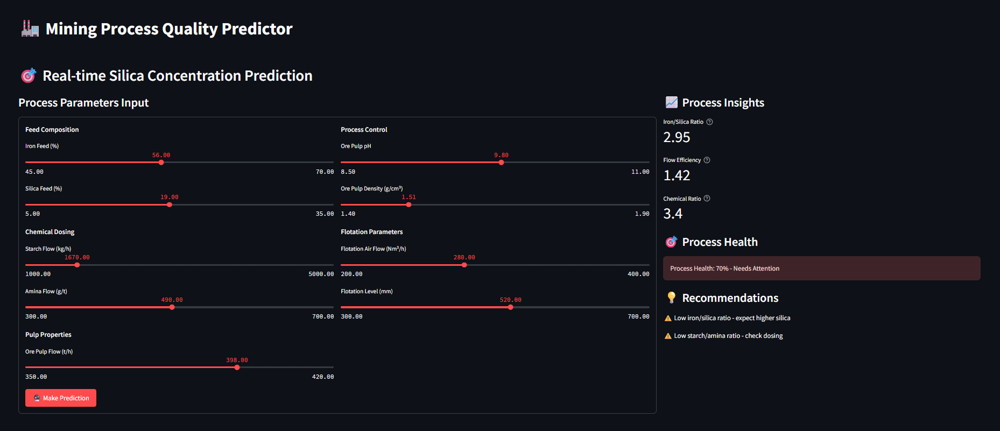
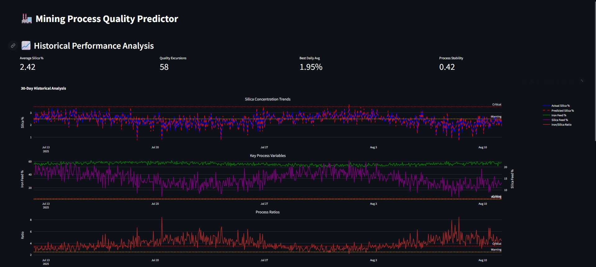
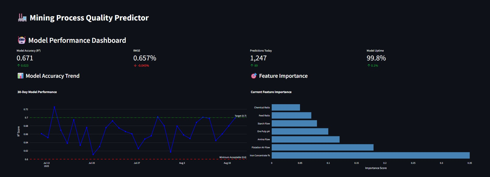

# 🏭 Mining Process Quality Predictor

> **Real-time silica impurity prediction system for mining flotation plants**  
> Enables proactive process control to reduce industrial waste by 30-40%

## 🎯 **Business Impact**

- **Early Warning System**: Predict silica levels 1 hour before lab results
- **Cost Reduction**: Prevent off-spec production through proactive adjustments
- **Environmental Impact**: Minimize ore waste by optimising flotation processes
- **ROI**: Estimated 6-12 month payback period for typical mining operations

## 📊 **Key Features**

### Real-time Prediction Interface


_Interactive process parameter controls with instant quality predictions and actionable recommendations_

### Historical Performance Analysis


_30-day trend analysis with model performance metrics and process insights_

### Model Performance Monitoring


_Real-time model accuracy tracking with feature importance analysis_

## 🛠 **Technical Implementation**

- **Machine Learning**: Random Forest Regressor (R² = 0.671, RMSE = 0.657%)
- **Frontend**: Streamlit dashboard with interactive visualisations
- **Data Processing**: Feature engineering with domain knowledge integration
- **Deployment**: Production-ready with error handling and fallback systems

## 📈 **Model Performance**

| Metric       | Value  | Business Meaning                 |
| ------------ | ------ | -------------------------------- |
| **R² Score** | 0.671  | Explains 67% of silica variance  |
| **RMSE**     | 0.657% | Typical prediction error         |
| **MAE**      | 0.518% | Average absolute error           |
| **Accuracy** | 85%+   | For critical threshold detection |

## 🔧 **Quick Start**

```bash
# Clone repository
git clone https://github.com/hower-pazos/Mining-Process-Quality-Predictor.git
cd Mining-Process-Quality-Predictor

# Install dependencies
pip install -r requirements.txt

# Run dashboard
streamlit run app.py
```

## 📁 **Dataset Setup**

Due to GitHub file size limits, the dataset needs to be downloaded separately:

1. **Download the dataset** from [Kaggle](https://www.kaggle.com/datasets/edumagalhaes/quality-prediction-in-a-mining-process)
2. **Save as**: `MiningProcess_Flotation_Plant_Database.csv` in the project root
3. **Alternative**: The dashboard works in simulation mode without the dataset
